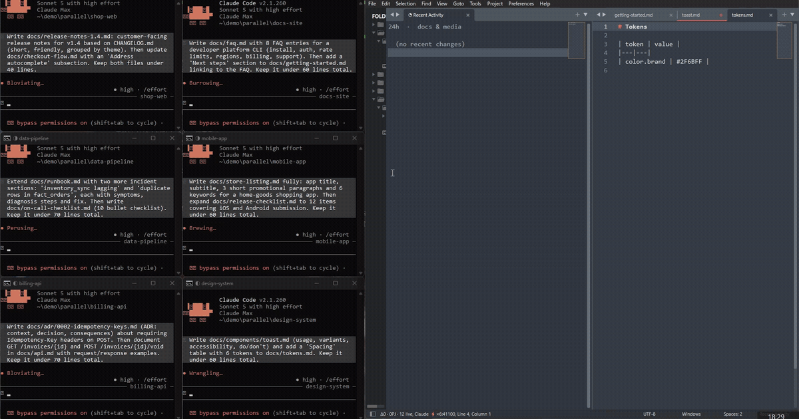

# Claude Code IDE for Sublime Text

[English](./README.md) | **日本語**

[Claude Code](https://claude.com/product/claude-code) を Sublime Text 4 にネイティブ統合するプラグイン — エディタ内 diff レビュー（Accept/Reject）、選択範囲のリアルタイム共有、`@`-mention に対応。公式の VS Code / JetBrains 拡張と同じ WebSocket/MCP プロトコルを実装しています。

> **非公式のコミュニティプラグインです** — Anthropic とは無関係であり、承認を受けたものではありません。「Claude」および「Claude Code」は Anthropic, PBC の商標です。



**ステータス: コア機能は動作します** — サーバー＋コンテキスト共有（M1）、エディタ内 diff レビュー（M2）、複数セッション並列接続まで、実際の Claude Code クライアントに対して E2E 検証済み。Package Control は申請中（下記の手動インストールは今すぐ使えます）。

## なぜ今 Sublime Text か

エージェントがコードの大半を書く時代に、エディタに求められるものは何か。私たちの答え:

- **一瞬で開いて軽い。** エージェントのセッション・ターミナル・ブラウザが RAM を食う中、コードを「読んで判断する」場所であるエディタは重くあるべきではない
- **自分で拡張できる。** Claude が Sublime プラグインを数分で書ける今、スクリプタブルな Python API は既製機能のマーケットプレイスに勝る。このプラグイン自体がその証明
- **AI を同梱しない、という選択。** AI ネイティブ IDE はエージェントとエディタを密結合にする。Claude Code はエディタ非依存 — 足りなかったのは Sublime と「会話する」薄いプロトコル層だけ

この思想の詳しい構造論: **[エディタを替えるな、エージェントを繋げ（日本語・Cognisant Insights）](https://cognisant.io/insights/editor-agent-decoupling)** ／ EN: [Don't Switch Your Editor — Connect the Agent](docs/dont-switch-your-editor.md)

## できること

Claude Code が接続すると（`/ide` または自動接続）:

- **エディタ内 diff レビュー** — Claude の編集提案を side-by-side diff で表示。Accept / Reject / 手直しして Accept
- **コンテキスト共有** — 現在の選択範囲、開いているタブ、ワークスペースフォルダ、未保存状態
- **`selection_changed` ストリーミング** — 今見ている場所を Claude が常に把握
- **`@`-mention** — 選択範囲をプロンプトへ送る
- **表示用 CLI** — `scripts/open_file.py <path>` でターミナルやエージェント自身からファイルをサイドペインに表示 —「Claude、成果物を見せて」のためのチャネル（FAQ 参照）
- **lock ファイル探索** — Sublime 内の Terminus からでも外部ターミナルからでも接続可能

## インストール（開発中につき手動）

1. このリポジトリを任意の場所に clone
2. Sublime の `Packages` に `Claude Code IDE` という名前でリンク（import は相対なのでどんな名前でも動きますが、Package Control インストールと同名にすると Preferences メニューのリンクが正しく解決します）:
   - **Windows**: `mklink /J "%APPDATA%\Sublime Text\Packages\Claude Code IDE" "C:\path\to\repo"`
   - **macOS/Linux**: `ln -s /path/to/repo "~/Library/Application Support/Sublime Text/Packages/Claude Code IDE"`
3. Sublime Text を再起動。ステータスバーに `Claude ○ :<port>` が出れば待受中
4. 任意のターミナルで `claude` を起動し、`/ide` で **Sublime Text** を選択

## 開発

プロトコルコア（`claudeide/`)は依存ゼロの純 Python 3.8 で、`sublime` を一切 import しないため Sublime の外で単体テストできます:

```bash
uv venv --python 3.8
uv pip install pytest
uv run pytest
```

Sublime 連携層は `adapters/sublime_bridge.py` + `plugin_main.py`。プロトコル実装の知見・Windows の罠は [docs/dev-notes.md](./docs/dev-notes.md) に記録しています。

## プロトコル

Claude Code の IDE 統合プロトコル（WebSocket + [MCP](https://modelcontextprotocol.io) 2025-03-26）を実装: `~/.claude/ide/<port>.lock` の lock ファイル、localhost 限定 WebSocket（`x-claude-code-ide-authorization` 認証）、標準ツールセット（`openFile`, `openDiff`, `getCurrentSelection`, `getOpenEditors`, …）。

プロトコルリファレンス: [coder/claudecode.nvim PROTOCOL.md](https://github.com/coder/claudecode.nvim/blob/main/PROTOCOL.md) — ドキュメント化してくれた同プロジェクトに感謝します。

## FAQ

### Claude Code は Sublime Text で使えますか？

使えます — このプラグインで。Claude Code に Sublime Text の組み込みサポートはありません（公式拡張は VS Code と JetBrains のみ）が、IDE 統合は WebSocket/MCP のプロトコルとして実装されています。本プラグインはそのプロトコルを Sublime にネイティブ実装しているため、エディタ内 diff レビュー・選択範囲コンテキスト・`@`-mention が公式拡張と同じ仕組みで動きます。

### Anthropic 公式のプラグインですか？

いいえ。非公式のコミュニティプラグインで、Anthropic とは無関係・未承認です。プロトコルは [claudecode.nvim](https://github.com/coder/claudecode.nvim/blob/main/PROTOCOL.md) プロジェクトがドキュメント化したものに準拠しています。

### どうやって接続しますか？

2通りあります:

1. **手動**: 任意のターミナルで `claude` を起動し、`/ide` で **Sublime Text** を選択
2. **自動接続**: プラグイン設定で固定 `"port"` を指定し、マシン全体の環境変数に `CLAUDE_CODE_SSE_PORT=<port>` と `ENABLE_IDE_INTEGRATION=true` を登録。以後、新しく起動した `claude` セッションはどのターミナルからでも（Sublime 内の Terminus 含む）起動 約2秒で自動接続します

### Claude がファイルを編集すると何が起きますか？

編集提案が Sublime 内に side-by-side diff タブとして開きます。提案ペインの ✓/✗ ボタン（コマンドパレットからも可。キーバインドは `Example.sublime-keymap` にコピペ用の見本を同梱）で Accept / Reject、または提案を手直ししてから Accept。あなたが判断するまで Claude は待機し、既定の権限設定ではレビューなしにディスクへ書き込まれることはありません。

### Claude に成果物ファイルを開いて見せてもらえますか？

MCP 経由では不可能です — Claude Code がモデルに公開する ide サーバーのツールは `getDiagnostics`/`executeCode` の2つだけで、接続中でもモデルは `openFile` を呼べません。同梱の CLI がそのためのチャネルです。Claude Code と同じ lock 探索＋認証付き WebSocket 接続でプラグインの `openFile` を直接呼ぶため、サイドグループ配置や `--preview`（transient タブ・フォーカスを奪わない）もそのまま効きます。`/ide` を実行していないセッションからでも、任意のターミナルから使えます:

```bash
python scripts/open_file.py path/to/report.html            # 表示してフォーカス
python scripts/open_file.py path/to/notes.md --preview     # ちら見せ・フォーカス奪わず
```

あとはエージェントに教えるだけです（例: CLAUDE.md に「見せるべき成果物は `scripts/open_file.py` で開く」）— 成果物が作られるそばから Sublime に現れるようになります。

この CLI はリポジトリ側にあります（`scripts/` はインストールパッケージに含まれません）。clone した checkout から実行してください — 上記の手動インストール構成ならそのまま使えます。

### コードはどこかに送信されますか？

プラグイン自体は何もネットワークに送りません。`127.0.0.1`（localhost 限定・トークン認証）の WebSocket サーバーとして、同じマシン上の Claude Code プロセスと通信するだけです。Claude Code 自体が Anthropic に送る内容は、IDE 統合なしで使う場合と同じで Claude Code 側の管理下にあります。

### 複数の Claude Code セッションを同時に使えますか？

使えます。サーバーは同時接続に対応しており、複数の claude セッション（プロジェクト別・タスク別など）が同じ Sublime に並列アタッチできます。各セッションの diff レビューは独立して管理されます。

### 対応プラットフォームは？

プロトコルコアは依存ゼロの Python 3.8（Sublime Text 4 のプラグインホスト）。Windows で開発・E2E 検証済み。macOS / Linux も同一コードパスで動作する想定です — 動作報告・issue 歓迎。

### AI ネイティブ IDE ではなく Sublime を使い続ける理由は？

エージェントはエディタの中に住む必要がないからです。Claude Code はターミナルで動き、エディタの仕事は「エージェントの提案を読み、判断し、時々手直しする」こと — Sublime が一瞬で、RAM 100–300 MB でこなす仕事です。疎結合ならエージェントとエディタを独立に更新でき、抱き合わせのサブスクもロックインもありません。

## ライセンス

MIT
